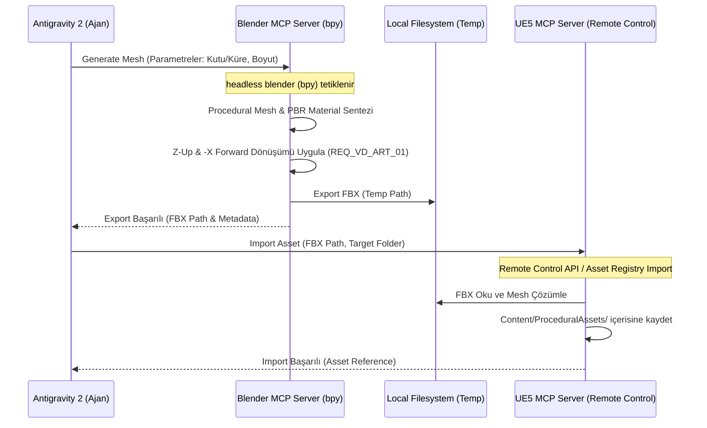
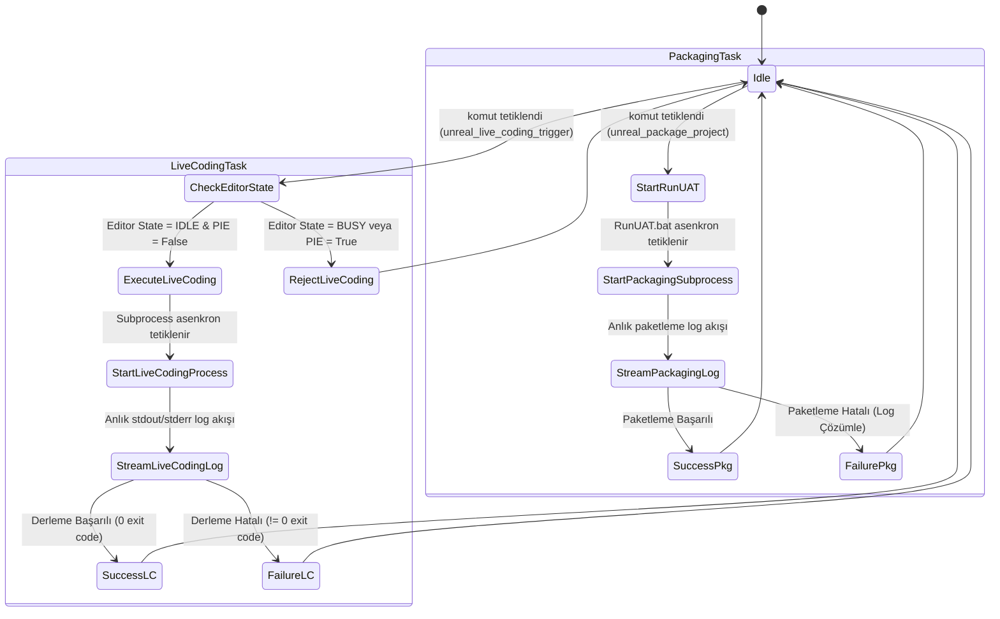

# L1-A: SİSTEM GEREKSİNİM DÖKÜMANI (SYSTEM REQUIREMENTS DOCUMENT - SRD)

**Proje Kodu:** LUDUS_MCP_2026  
**Doküman Kodu:** SRD_MASTER_01  
**Versiyon:** v0.1:0  
**Doküman Sahibi:** @sys-prime (Lead Game Designer / Product Owner)  
**Sistem Durumu:** İNCELEMEDE / GATED STEP 2  

---

## 1. Mekanik Özet ve Amacı

Bu doküman, "Ludus Magnus" Dual MCP Server Suite yazılımının fonksiyonel sistem gereksinimlerini tanımlar. Sistem, Unreal Engine 5 editörünün Remote Control API'si ile Blender'ın yerel `bpy` kütüphanesini bağımsız asenkron sunucu örnekleri (Model Context Protocol) olarak koordine eder. Amaç, bölünmüş ekran (split-screen) geliştirme arayüzünde otonom ajanların (Antigravity 2) Unreal ve Blender üzerinde sıfır insan eforuyla görsel manipülasyon, prosedürel üretim ve derleme yapmasını sağlamaktır.

---

## 2. Fonksiyonel Gereksinimler Listesi (System Requirements Matrix)

Tüm işlevsel gereksinimler L0 Vision Document (`docs/ProjectDocuments/VD.md`) sınırlarına bağlı olarak aşağıda kilitlenmiştir:

| Gereksinim ID | Fonksiyon / Sistem Adı | Bağlı Olduğu L0 Kısıtı | Mantıksal Koşul ve Fonksiyonel Açıklama |
| :--- | :--- | :--- | :--- |
| **[REQ_SRD_UE5_01]** | Viewport Telemetry Alma | `[REQ_VD_TEC_01]` | Ajan, aktif Unreal editör kamerasının koordinatlarını, rotasyonunu, görüş açısını (FOV) ve o an seçili olan aktörlerin ID/sınıf listesini asenkron olarak sorgulayıp alabilmelidir. |
| **[REQ_SRD_UE5_02]** | Gerçek Zamanlı Aktör Spawn Etme | `[REQ_VD_SCP_01]` | Ajan; `StaticMeshActor`, `PointLight`, `DirectionalLight` ve `CameraActor` tiplerini editör içerisinde belirtilen dünya koordinatlarında gerçek zamanlı olarak yaratabilmelidir (spawn). |
| **[REQ_SRD_UE5_03]** | Aktör Transformasyon Manipülasyonu | `[REQ_VD_TEC_01]` | Spawn edilmiş veya seçilmiş olan herhangi bir aktörün lokasyon (Location), rotasyon (Rotation) ve ölçek (Scale) bilgileri uzaktan güncellenebilmelidir. Gecikme 50ms'yi aşmamalıdır. |
| **[REQ_SRD_UE5_04]** | Live Coding Tetikleyici Köprüsü | `[REQ_VD_TEC_03]` | Editör açıkken C++ sınıflarında değişiklik yapıldığında, `unreal_live_coding_trigger` aracı üzerinden asenkron Live Coding derlemesi başlatılabilmelidir. PIE modunda ise işlem reddedilmelidir. |
| **[REQ_SRD_UE5_05]** | RunUAT Bağımsız Paketleme | `[REQ_VD_TEC_04]` | Projenin tamamı `unreal_package_project` aracıyla paketleme testine sokulabilmelidir. Bu işlem Windows alt süreci (subprocess) olarak asenkron çalışmalı ve logları stream etmelidir. |
| **[REQ_SRD_BLN_01]** | Prosedürel 3D Mesh Üretimi | `[REQ_VD_ART_01]` | Blender MCP sunucusu, ajandan gelen parametrelere (yükseklik, yarıçap, poligon sıklığı) göre Blender `bpy` modülünü headless olarak tetikleyerek 3D modeller üretmelidir. |
| **[REQ_SRD_BLN_02]** | Prosedürel PBR Materyal Üretimi | `[REQ_VD_ART_02]` | Blender tarafında üretilen modellere atanmak üzere, renk (Albedo), pürüzlülük (Roughness), metaliklik (Metallic) gibi parametrik PBR materyal yapıları kodla oluşturulabilmelidir. |
| **[REQ_SRD_BLN_03]** | Headless FBX Dışa Aktarım Köprüsü | `[REQ_VD_ART_01]` | Blender üzerinde üretilen mesh ve materyaller, Z-up ve -X forward eksen dönüşümleri otomatik yapılarak geçici bir klasöre `.fbx` olarak asenkron şekilde ihraç edilmelidir. |
| **[REQ_SRD_INT_01]** | Otomatik UE5 Varlık İthalatı (Import) | `[REQ_VD_VAL_01]` | Blender tarafından ihraç edilen `.fbx` dosyası, Unreal Engine Remote Control API / Asset Registry üzerinden sessizce UE5 projesinin `Content/ProceduralAssets` dizinine ithal edilmelidir. |
| **[REQ_SRD_INT_02]** | JSON-RPC 2.0 MCP Transport | `[REQ_VD_TEC_02]` | Unreal ve Blender sunucuları, istemciyle (Antigravity 2) standart stdio transport üzerinden JSON-RPC 2.0 protokolü kurallarına uygun olarak haberleşmelidir. |

---

## 3. Sistem İş Akışları (System Pipelines)

### 3.1. Prosedürel Varlık Hattı (Blender -> UE5 FBX Import Pipeline)

Aşağıdaki akış diyagramı, Blender üzerinde otonom üretilen bir 3D varlığın Unreal Engine içerisine aktarım hattını gösterir:

### 3.2. Çift Katmanlı Derleme Hattı (Live Coding & RunUAT Pipeline)

C++ kod değişikliklerinin ve proje paketleme testlerinin asenkron alt süreçlerle yönetilme hattı:

---

## 4. Sistem Durum Makinesi (System State Machine)

Sistem genelindeki ana durumlar ve bu durumların izin verdiği operasyonel geçişler aşağıda tanımlanmıştır:

* **`SYSTEM_INITIALIZING` (Başlatılıyor):** Python sunucuları ayağa kalkıyor, portlar taranıyor ve Remote Control API bağlantısı test ediliyor.
  - *Geçiş Koşulu:* Bağlantı kurulduğunda ve stdio bağlandığında `SYSTEM_READY` durumuna geç.
* **`SYSTEM_READY` (Hazır):** Sistem boşta ve ajan komutlarını bekliyor. Tüm spawn ve transform okuma/yazma işlemleri bu durumda yapılabilir.
  - *Geçiş Koşulu:* Blender mesh üretimi tetiklendiğinde `SYSTEM_BLENDER_BUSY` durumuna geç.
  - *Geçiş Koşulu:* Live Coding tetiklendiğinde `SYSTEM_LIVE_CODING_BUSY` durumuna geç.
  - *Geçiş Koşulu:* RunUAT tetiklendiğinde `SYSTEM_PACKAGING_BUSY` durumuna geç.
* **`SYSTEM_BLENDER_BUSY` (Blender Meşgul):** Arka planda prosedürel 3D mesh üretimi ve FBX dışa aktarımı yapılıyor. UE5 telemetry okuma aktif kalabilir ancak yeni bir Blender talebi reddedilir.
  - *Geçiş Koşulu:* FBX dosyası yazıldığında ve Blender kapatıldığında `SYSTEM_READY` durumuna geri dön.
* **`SYSTEM_LIVE_CODING_BUSY` (Derleme Meşgul):** Unreal C++ kodu Live Coding mekanizmasıyla derleniyor. Yeni bir spawn veya transform yazma işlemi editör kilitlemesini önlemek için sıraya alınır (queue).
  - *Geçiş Koşulu:* Alt süreç (subprocess) tamamlandığında `SYSTEM_READY` durumuna geç.
* **`SYSTEM_PACKAGING_BUSY` (Paketleme Meşgul):** Proje `RunUAT.bat` üzerinden paketleniyor. Ağır CPU/IO yükü nedeniyle tüm transform ve bpy işlemleri askıya alınır (suspend).
  - *Geçiş Koşulu:* Paketleme tamamlandığında `SYSTEM_READY` durumuna geç.

---

### Game Director / Product Owner Onayı
* **Durum:** L1-A Sistem Gereksinim Dokümanı (SRD) oluşturuldu. Bir sonraki aşama olan L1-B Teknik Tasarım Dokümanı'na (Technical Design Document - TDD) geçmek için kullanıcı onayı bekleniyor.
* **Karar/Onay İmzası:** *Beklemede...*
