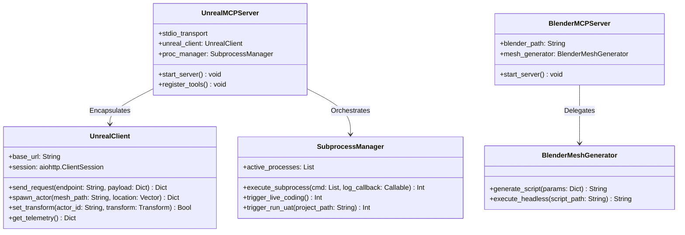

# L1-B: TEKNİK TASARIM DÖKÜMANI (TECHNICAL DESIGN DOCUMENT - TDD)

**Proje Kodu:** LUDUS_MCP_2026  
**Doküman Kodu:** TDD_MASTER_01  
**Versiyon:** v0.2:0  
**Doküman Sahibi:** @core-arch (Technical Director / Lead Architect)  
**Sistem Durumu:** İNCELEMEDE / GATED STEP 3  

---

## 1. Teknik Mimari Özet

"Ludus Magnus" Dual MCP Server Suite, otonom yazılım geliştirme arayüzleri (Antigravity 2) için sıfır-bloklama (non-blocking) ile çalışan asenkron bir Python altyapısı üzerine inşa edilecektir. 

Mimari, iki bağımsız Model Context Protocol (MCP) sunucusundan oluşur:
1. **Unreal Engine 5 MCP Server (Primary):** Unreal Engine'in yerleşik **Remote Control Web Server** (varsayılan: `http://localhost:30010`) bileşeniyle `aiohttp` kullanarak asenkron HTTP POST / JSON-RPC 2.0 istekleri üzerinden haberleşir. Editör içi Live Coding ve proje paketleme (RunUAT) işlemleri için Python'un `asyncio.subprocess` kütüphanesini kullanarak arka planda asenkron Windows komut satırı süreçleri (shell subprocesses) yönetir.
2. **Blender MCP Server (Secondary):** Sistem kaynaklarını boşa harcamamak adına sürekli arka planda çalışan ağır bir servis yerine; talep geldiğinde parametrik çalışan **Headless Blender Worker** (`blender.exe --background --python <script>`) süreçleri üretir ve asenkron olarak sonuçları derler.

---

## 2. No-Tick Policy ve Asenkron I/O Bildirgesi

### 2.1. No-Tick Mimarisi
Sistemde kesinlikle **Tick tabanlı polling (döngüsel veri sorgulama) mekanizması kullanılmayacaktır**.
- Unreal Engine viewport telemetry'si veya aktör durumları, arka planda bir `while True` döngüsüyle sürekli sorgulanmayacak, sadece istemciden (Antigravity 2) bir araç talebi geldiğinde anlık (on-demand) tetiklenecektir.
- Bu yaklaşım, local işlemcinin (CPU) boşa harcanmasını engeller, Unreal Engine editörünün frame-time bütçesini ($16.6\text{ ms}$) ve viewport render performansını hiçbir koşulda etkilemez.

### 2.2. Asenkron I/O Yönetimi
Tüm sunucu mimarisi Python'un yerel `asyncio` kütüphanesiyle yazılacaktır:
- Sunucu ve istemci arasındaki stdio transport kanalı asenkron okunacaktır.
- Unreal Engine Remote Control API'ye atılan HTTP istekleri `aiohttp` kütüphanesiyle asenkron yönetilecektir.
- Derleme ve paketleme alt süreçleri `asyncio.create_subprocess_exec` ile başlatılarak, log okuma döngüleri `readline()` metodu üzerinden asenkron işletilecektir.

---

## 3. Sınıf Mimarisi ve Paket Yapısı (Class Architecture)

Sistem tamamen nesne yönelimli programlama (OOP) kurallarına ve tek sorumluluk prensibine (Single Responsibility) uygun olarak şu sınıflar etrafında kurulacaktır:



### 3.1. Klasör ve Paket Yapısı
```
/C:/repo/2_UnrealMCP/
├── docs/
│   └── ProjectDocuments/
│       ├── VD.md (L0)
│       ├── SRD.md (L1-A)
│       └── TDD.md (L1-B)
├── Standarts/
│   └── ...
├── src/
│   ├── common/
│   │   ├── __init__.py
│   │   ├── protocol.py       # JSON-RPC 2.0 Şemaları ve MCP Protokol Helperları
│   │   └── transforms.py     # Koordinat Dönüşüm Matrisleri (Blender <-> UE5)
│   ├── unreal_server/
│   │   ├── __init__.py
│   │   ├── server.py         # UnrealMCPServer Ana Giriş Sınıfı
│   │   ├── client.py         # UnrealClient (Remote Control API Wrapper)
│   │   └── execution.py      # SubprocessManager (Live Coding & RunUAT)
│   └── blender_server/
│       ├── __init__.py
│       ├── server.py         # BlenderMCPServer Ana Giriş Sınıfı
│       ├── generator.py      # BlenderMeshGenerator (bpy scripting engine)
│       └── templates/
│           └── procedural_mesh.py # Headless çalıştırılacak ham bpy template'i
```

---

## 4. Veri Yapıları ve JSON-RPC Protokol Şemaları (Data Structures)

### 4.1. Unreal Engine Viewport Telemetry Şeması (Response payload)
```json
{
  "jsonrpc": "2.0",
  "result": {
    "camera": {
      "location": {"x": 1200.5, "y": -450.2, "z": 90.0},
      "rotation": {"pitch": -15.0, "yaw": 180.0, "roll": 0.0},
      "fov": 90.0
    },
    "selected_actors": [
      {
        "actor_id": "BP_PlayerStart_C_0",
        "actor_class": "/Game/Blueprints/BP_PlayerStart.BP_PlayerStart_C",
        "transform": {
          "location": {"x": 0.0, "y": 0.0, "z": 100.0},
          "rotation": {"pitch": 0.0, "yaw": 0.0, "roll": 0.0},
          "scale": {"x": 1.0, "y": 1.0, "z": 1.0}
        }
      }
    ]
  },
  "id": 1
}
```

### 4.2. Koordinat Sistemi Çeviri Matrisi (Z-up Right-to-Left conversion)
Blender ve Unreal koordinat dönüşümleri `src/common/transforms.py` sınıfında şu formüllerle asenkron çağrılardan önce kilitlenecektir:

```python
class CoordinateConverter:
    @staticmethod
    def blender_to_unreal_location(b_loc: dict) -> dict:
        """
        Blender (Z-Up, Right-Handed) -> Unreal (Z-Up, Left-Handed)
        X_ue = b_loc['x'] * 100.0 (Metre -> Santimetre dönüşümü)
        Y_ue = b_loc['y'] * 100.0
        Z_ue = b_loc['z'] * 100.0
        """
        return {
            "x": float(b_loc["x"]) * 100.0,
            "y": float(b_loc["y"]) * 100.0,
            "z": float(b_loc["z"]) * 100.0
        }

    @staticmethod
    def blender_to_unreal_rotation(b_rot: dict) -> dict:
        """
        Blender Rotasyon Eksenlerini Unreal Rotasyon Eksenlerine (Pitch, Yaw, Roll) Dönüştürür.
        """
        return {
            "pitch": float(b_rot["y"]), # Blender Y rotasyonu -> UE5 Pitch
            "yaw": float(b_rot["z"]),   # Blender Z rotasyonu -> UE5 Yaw
            "roll": float(b_rot["x"])   # Blender X rotasyonu -> UE5 Roll
        }
```

---

## 5. Mühendislik Tasarım Gereksinimleri Matrisi (TDD Requirements Matrix)

| Teknik ID | Açıklama | İlişkili SRD ID | Bağlı Olduğu L0 Kısıtı |
| :--- | :--- | :--- | :--- |
| **[REQ_TDD_ARC_01]** | Python `mcp` SDK stdio haberleşme katmanının kurulması ve hata yakalama (exception handling) middleware yapısının tasarlanması. | `[REQ_SRD_INT_02]` | `[REQ_VD_TEC_02]` |
| **[REQ_TDD_ARC_02]** | `aiohttp.ClientSession` yönetimi ile Unreal Engine Web Server'a asenkron bağlantı açılması ve havuz yönetimi (connection pooling). | `[REQ_SRD_UE5_01]` | `[REQ_VD_TEC_01]` |
| **[REQ_TDD_ARC_03]** | `unreal_live_coding_trigger` için asenkron Windows alt sürecinin (`asyncio.create_subprocess_exec`) yazılması ve çıkış loglarının toplanması. | `[REQ_SRD_UE5_04]` | `[REQ_VD_TEC_03]` |
| **[REQ_TDD_ARC_04]** | `RunUAT.bat` parametrik Windows alt sürecinin (`BuildCookRun` komut setiyle) asenkron olarak tetiklenmesi ve bellek yönetimi. | `[REQ_SRD_UE5_05]` | `[REQ_VD_TEC_04]` |
| **[REQ_TDD_ARC_05]** | Headless Blender çalıştırıcı sınıfının parametre doğrulaması (parameter validation) ve Python script şablon enjektörünün tasarımı. | `[REQ_SRD_BLN_01]` | `[REQ_VD_TEC_02]` |
| **[REQ_TDD_ARC_06]** | Blender-UE5 eksen ve ölçek dönüşümlerini yapacak `CoordinateConverter` modülünün yazılması. | `[REQ_SRD_BLN_03]` | `[REQ_VD_ART_01]` |
| **[REQ_TDD_ARC_07]** | Sistem genelinde döngüsel polling kullanımını tamamen engelleyen, sadece event tabanlı çalışan asenkron mimari kuralının uygulanması. | `[REQ_SRD_UE5_01]` | `[REQ_VD_TEC_02]` |
| **[REQ_TDD_ARC_08]** | Dinamik Python Script Çalıştırma Köprüsü için soket tabanlı Python Remote Execution TCP port haberleşme entegrasyonu. | `[REQ_SRD_UE5_06]` | `[REQ_VD_TEC_02]` |
| **[REQ_TDD_ARC_09]** | `EditorActorSubsystem.get_all_level_actors()` ve bileşen özelliklerini sorgulayan hiyerarşik sorgu kütüphanesi. | `[REQ_SRD_UE5_07]` | `[REQ_VD_TEC_01]` |
| **[REQ_TDD_ARC_10]** | Blueprint class yollarının dinamik yansıma (reflection) ile çözümlenmesi ve spawn edilmesi modülü. | `[REQ_SRD_UE5_08]` | `[REQ_VD_SCP_01]` |
| **[REQ_TDD_ARC_11]** | Unreal `EditorUndo` transaction tetikleyici API uçlarının entegrasyonu. | `[REQ_SRD_UE5_09]` | `[REQ_VD_TEC_01]` |

---

### Lead Architect Onayı
* **Durum:** L1-B Teknik Tasarım Dokümanı (TDD) oluşturuldu. Bir sonraki aşama olan L1-C Pipeline & Integration Document'a (PID) geçmek için kullanıcı onayı bekleniyor.
* **Karar/Onay İmzası:** *Beklemede...*
