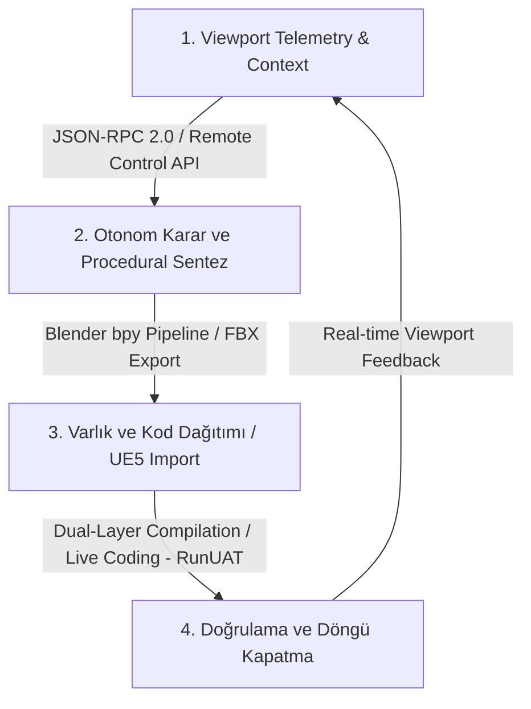

# L0: PROJE VİZYON DÖKÜMANI (VISION DOCUMENT)

**Proje Kodu:** LUDUS_MCP_2026  
**Versiyon:** v0.1:0  
**Doküman Sahibi:** @sys-prime (Game Director / Product Owner)  
**Sistem Durumu:** İNCELEMEDE / GATED STEP 1  

---

## 1. Executive Summary (Proje Özeti)

* **Proje Adı:** "Ludus Magnus" Dual MCP Server Suite (DualMCP)
* **Tür (Genre):** Geliştirici Verimlilik Aracı & Otonom Editör Entegrasyonu
* **Kamera Açısı / Perspektif:** İki Bölünmüş Ekran (Split-Screen Workspace: Sol tarafta Antigravity 2 MCP Chat Arayüzü, Sağ tarafta gerçek zamanlı tepki veren Unreal Engine 5 Editörü ve arka planda çalışan Blender)
* **Hedef Platform:** Windows Desktop 10/11 (Geliştirici İş İstasyonu)
* **Oyun Motoru / Altyapı:** Unreal Engine 5.3+ (Primary), Blender 4.x+ (Secondary), Native Python 3.10+, JSON-RPC 2.0
* **Elevator Pitch:** "Ludus Magnus" Dual MCP Server Suite, Antigravity 2 platformunun otonom yapay zeka kabiliyetlerini doğrudan Unreal Engine 5 ve Blender 3D üretim ortamlarına bağlayan, yerel Python tabanlı bir çift örnekli (dual-instance) Model Context Protocol (MCP) framework'üdür. Geliştiricinin bölünmüş ekran çalışma alanında; C++ kod derlemelerinden aktör yerleşimine, Blender bpy üzerinden prosedürel mesh üretiminden otomatik FBX köprüsüyle UE5 entegrasyonuna kadar tüm süreçleri insan hatasından arındırılmış, otomotiv kalitesinde (Ford Otosan ve ASPICE L1/L2) standartlarla yönetir.

---

## 2. Core System Loop (Çekirdek Sistem Döngüsü)

Geliştiricinin ve otonom ajanın (Antigravity 2) sistemle olan etkileşimi aşağıdaki 4 temel makro adımdan oluşan döngü üzerine kuruludur:

1. **Viewport Telemetry & Context:** Unreal Engine 5 editörünün kamera pozisyonu, seçili aktör bilgileri ve dünya telemetry verilerinin asenkron Python MCP Server aracılığıyla okunması ve ajana bağlam olarak sunulması.
2. **Otonom Karar ve Procedural Sentez:** Ajanın, gelen komuta göre Blender bpy API üzerinden prosedürel mesh/materyal üretimi yapması veya Unreal Actor transformasyon manipülasyonu kararı alması.
3. **Varlık ve Kod Dağıtımı:** Üretilen 3D varlığın FBX formatında otomatik olarak export edilip UE5 Asset Registry'ye aktarılması; eş zamanlı olarak C++ sınıflarında gerekli kod değişikliklerinin yapılması.
4. **Doğrulama ve Döngü Kapatma (Dual-Layer Compilation):** C++ sınıflarının editör içi Live Coding tetikleyicisiyle derlenmesi veya paketleme testi (RunUAT) ile doğrulanması. Değişikliklerin viewport telemetry'si üzerinden doğrulanmasıyla döngü tamamlanır.

---

## 3. Unique Selling Points (USP - Benzersiz Satış Noktaları)

* **[USP_01] Split-Screen Gerçek Zamanlı Manipülasyon:** Geliştiricinin IDE/Chat ekranında yazdığı veya ajan tarafından üretilen kararların, milisaniyeler içerisinde sağ ekrandaki aktif Unreal Engine 5 viewport'unda görsel olarak spawn/transform bulması.
* **[USP_02] Blender-UE5 Otonom Varlık Köprüsü (Automated FBX Pipeline):** Blender'ın yerel `bpy` kütüphanesini arka planda sessizce (headless) kullanarak, sıfırdan prosedürel 3D mesh ve materyal üretip, ASPICE uyumlu transform matris dönüşümleriyle UE5 içerisine otomatik aktarması.
* **[USP_03] Çift Katmanlı Entegre Derleme Motoru (Dual-Layer Compilation Engine):** Açık editörde C++ derlemesi için `unreal_live_coding_trigger` ve dağıtım testleri için bağımsız asenkron `unreal_package_project` (RunUAT) alt süreçlerinin tek arayüzden yönetilmesi.

---

## 4. Production Constraints Matrix (Üretim Kısıtları Matrisi)

| Gereksinim ID | Kategori | Açıklama ve Kesin Sınır |
| :--- | :--- | :--- |
| **[REQ_VD_TEC_01]** | Ağ İletişimi (Local Latency) | Tüm MCP sunucu çağrıları ve UE5 Remote Control API haberleşmeleri yerel ağda (localhost) çalışmalıdır. Uçtan uca (End-to-End) istek-cevap gecikmesi (latency) **maksimum 50ms** olmalıdır. |
| **[REQ_VD_TEC_02]** | Asenkron I/O ve Kilitsiz Mimari | Python sunucu katmanı tamamen `asyncio` tabanlı asenkron yapıda kurulacaktır. CPU yoğun derleme veya paketleme işlemleri, MCP'nin ana giriş/çıkış (I/O) döngüsünü kesinlikle kilitlememelidir (non-blocking). |
| **[REQ_VD_TEC_03]** | Live Coding Tetikleme Limitleri | `unreal_live_coding_trigger` komutu, editörün çökmesini engellemek amacıyla sadece Unreal Editor boşta (idle) konumdayken ve PIE (Play In Editor) aktif değilken tetiklenebilmelidir. |
| **[REQ_VD_TEC_04]** | RunUAT Paketleme Yalıtımı | `unreal_package_project` işlemi, bağımsız bir Windows alt süreci (subprocess) olarak başlatılmalı, çıkış (stdout/stderr) logları `RunUAT.bat` üzerinden anlık okunmalı ve bellek sızıntılarını önlemek için işlem bittiğinde süreç düzgünce sonlandırılmalıdır. |
| **[REQ_VD_ART_01]** | Blender FBX Çeviri Matrisi | Blender'dan ihraç (export) edilen tüm varlıklar, Unreal Engine'in **Z-up, -X Forward** koordinat sistemiyle tam uyumlu olacak şekilde, Blender `bpy` seviyesinde transformasyon matrisi dönüşümüne tabi tutulmalıdır. Manuel pivot düzeltmesi gerektirmemelidir. |
| **[REQ_VD_ART_02]** | Prosedürel Materyal Standartları | Blender tarafında üretilen materyaller, UE5'e aktarılırken "Material Instance" yapısına uygun parametrik veri setleriyle transfer edilmeli, shader derleme sürelerini minimize edecek standart PBR kanallarını (Albedo, Roughness, Metallic, Normal) içermelidir. |
| **[REQ_VD_SCP_01]** | MVP Aktör Kapsam Sınırı | İlk fazda otonom spawn ve manipülasyon için desteklenen aktör tipleri sadece `StaticMeshActor`, `PointLight`, `DirectionalLight` ve `CameraActor` ile sınırlıdır. Skeletal mesh veya karakter blueprint'leri MVP kapsamında yer almaz. |
| **[REQ_VD_SCP_02]** | Versiyon ve Motor Bağımlılığı | Sistem, Unreal Engine 5.3 ve 5.4 sürümleri ile Blender 4.0 ve üzeri sürümleri destekleyecektir. Geriye dönük uyumluluk hedeflenmemiştir. |
| **[REQ_VD_VAL_01]** | ASPICE Traceability (İzlenebilirlik) | Geliştirilen her alt seviye gereksinim (SRD, TDD), test senaryosu (QA) ve kod sınıfı (L3), L0 vizyon belgesindeki en az bir `REQ_VD` ID'sine izlenebilirlik bağıyla bağlanacaktır. |
| **[REQ_VD_VAL_02]** | Sürüm Kontrol Kapısı | Hiçbir kod değişikliği, ilişkili bir Product Backlog Item (PBI) gereksinimi ve `vA.B:C` formatında commit mesajı olmadan doğrudan `develop` veya `master` branch'ine entegre edilemez. |

---

## 5. Kritik Uyarılar ve Risk Analizi

Bu bölümde, projenin mimari tasarımı ve fiziksel kodlama süreçleri başlamadan önce elenmesi gereken en kritik teknik riskler ve bunlara karşı geliştirilen mühendislik çözümleri listelenmiştir:

### Risk 1: Çoklu İş Parçacığı Tıkanmaları (Multi-Threading Blocks)
* **Açıklama:** Unreal Engine paketleme (RunUAT) veya Blender 3D render/export işlemleri sırasında Python MCP sunucusunun ana thread'inin tıkanması, Antigravity 2 arayüzü ile sunucu arasındaki bağlantının kopmasına ve JSON-RPC zaman aşımı hatalarına yol açar.
* **Mühendislik Çözümü (Mitigation):** Sunucudaki tüm yoğun I/O ve proses çağrıları, Python'un `asyncio.create_subprocess_exec` modülüyle asenkron alt süreçlere devredilecektir. İşlem logları `asyncio.StreamReader` aracılığıyla asenkron olarak okunarak sunucu ana döngüsü asla bloke edilmeyecektir (`REQ_VD_TEC_02` ile uyumlu).

### Risk 2: Live Coding Sırasında Editör Kilitlenmeleri (Unreal Editor Locks)
* **Açıklama:** Kullanıcı editörde aktif olarak bir işlem yaparken veya PIE (Play In Editor) modundayken dışarıdan gönderilen bir Live Coding tetikleyicisi, derleyicinin (UHT) dosya erişim kilitlemelerine (file lock) veya Unreal Editor'ün aniden kapanmasına (crash) yol açar.
* **Mühendislik Çözümü (Mitigation):** `unreal_live_coding_trigger` çalıştırılmadan önce, Remote Control API üzerinden editörün güncel durumu (Editor State: Play/Pause/Idle) sorgulanacak, eğer editör kritik bir işlemde ise istek sıraya alınacak veya güvenli bir hata koduyla reddedilecektir (`REQ_VD_TEC_03` ile uyumlu).

### Risk 3: Blender bpy Headless Alt Süreç Çökmeleri
* **Açıklama:** Blender'ın arka planda (`--background`) çalıştırılarak prosedürel model üretimi yaptığı senaryolarda, hatalı Python scriptleri veya yetersiz sistem kaynakları nedeniyle Blender süreci sessizce çökebilir ve Python MCP Server'a cevap dönmeyebilir.
* **Mühendislik Çözümü (Mitigation):** Blender üzerinde çalıştırılacak tüm `bpy` scriptleri, sıkı hata yakalama (`try-except`) bloklarıyla sarılacak ve hata durumunda Python MCP Server'a standart JSON-RPC 2.0 hata kodlarıyla detaylı hata logları döndürülecektir. Süreç için bir "Timeout" (maksimum 30 saniye) sınırı belirlenecektir.

### Risk 4: FBX Import/Export Koordinat Sistemi Kaymaları (Transform Drift)
* **Açıklama:** Blender ve Unreal Engine'in varsayılan koordinat eksenlerinin (Blender: Z-up, Right-Handed; Unreal: Z-up, Left-Handed) ve pivot noktalarının farklı olması, prosedürel üretilen modellerin UE5 editörüne aktarıldığında ters dönmesine, boyutlarının bozulmasına veya pivotlarının kaymasına neden olur.
* **Mühendislik Çözümü (Mitigation):** Blender export scriptlerinde, transform matrisleri doğrudan `bpy.ops.export_scene.fbx` fonksiyon parametreleriyle (`axis_forward='-Z'`, `axis_up='Y'`) veya matris çarpımı yoluyla normalize edilecek, UE5 import aşamasında ise otomatik pivot hizalama parametreleri aktif hale getirilecektir (`REQ_VD_ART_01` ile uyumlu).

---

### Game Director / Product Owner Onayı
* **Durum:** L0 Vizyon Dokümanı oluşturuldu. Bir sonraki aşama olan L1-A Sistem Gereksinim Dokümanı'na (SRD) geçmek için kullanıcı onayı bekleniyor.
* **Karar/Onay İmzası:** *Beklemede...*
